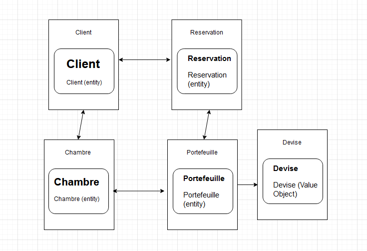

# Hotel

# Design Stratégique
## Ubiquitous Language
   ### Client
        Définition : Représente une personne utilisant les services de l'hôtel.

### Réservation
    Définition : Un engagement de la part d'un client pour réserver une chambre dans l'hôtel pour une période spécifique.

### Chambre
    Définition : Un espace d'hébergement dans l'hôtel pouvant être réservé par un client.

### Portefeuille (Wallet)
    Définition : Un mécanisme pour gérer le solde financier d'un client, associé à une devise.

### Devise (Currency)
    Définition : Une unité monétaire utilisée pour représenter le solde dans le portefeuille.

## Bounded Contexts

   ### Hotel Context
        Entities : Client, Réservation, Chambre, Portefeuille
        Value Objects : Devise
## Schema:


## Core/Supporting/Generic Domains

   ### Domaine Cœur (Core Domain)
        Chambre (reservation)

### Domaines de Support (Supporting Domains)
    Reservation, confirmation de reservation.

### Domaines Génériques (Generic Domains)
    authentification, Payement, chargement du portefeuille (toutes devises..), annulation de reservation.
## Design Tactique
## Entities

   ### Client
        Propriétés : fullName, email, phoneNumber, wallet
        Méthodes : updateClient, deleteClient, generateClientDocument

  ###  Réservation
        Propriétés : id, client, room, checkInDate, numberOfNights, status, totalAmount, confirmationDate
        Méthodes : confirmReservation, cancelReservation

  ###  Chambre
        Propriétés : id, type, pricePerNight, features
        Méthodes : updateRoom, deleteRoom

  ###  Portefeuille (Wallet)
        Propriétés : id, balance, currency
        Méthodes : credit, debit, refund

## Value Objects

 ###   Devise (Currency)
        Propriétés : EURO, DOLLAR, POUND_STERLING, YEN, SWISS_FRANC

### Portefeuille (Wallet)
        Propriétés : balance, currency

    Ces objets de valeur sont utilisés pour encapsuler des concepts sans identité propre, tels que les devises et les portefeuilles, qui sont essentiels pour représenter des aspects financiers dans le système.


# Installation du projet:

## Backend:
C'est le package hotel.
### pour La DB:
```
 docker run -d -p 27017:27017 --name mon-container-mongo mongo
```
### pour lancer les test fonctionnels:
```
 python3 test.py
```
puis lancer l'application (avec intelliJ de préférence)
## Frontend:
C'est le package hotelfront.
### pour lancer (il faut installer flutter):
```
 flutter run -d chrome
```